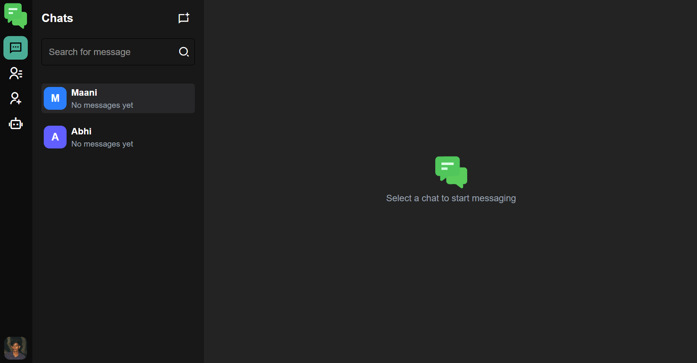
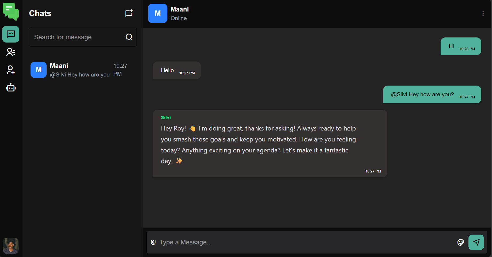
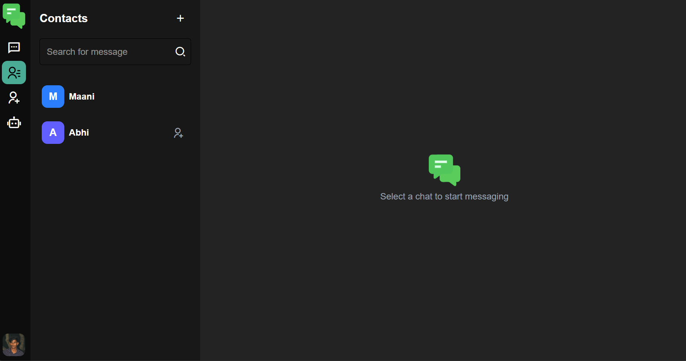
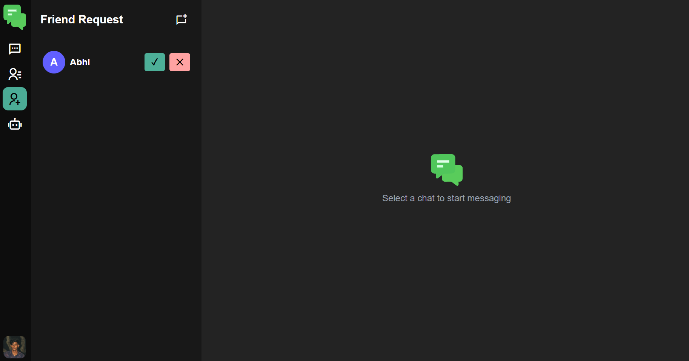
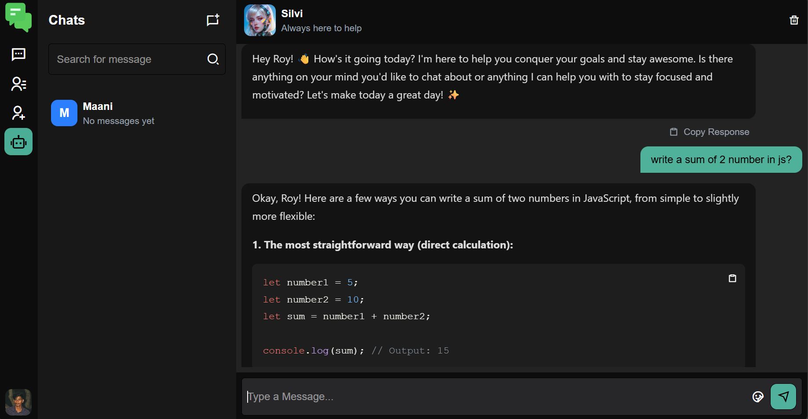
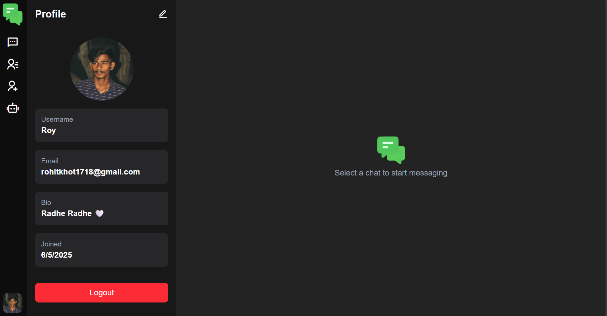

# 💬 ChatVerse

**ChatVerse** is a real-time full-stack chat application built with the **MERN stack** (MongoDB, Express, React, Node.js). It features secure user authentication, private messaging with real-time send/receive, friend request management, last message previews, unread messages, image sharing, AI-powered chat with **Silvi**, profile editing with bio and picture uploads, responsive design, and seamless user interactions for a modern chat experience.

---

## 🚀 Features

- 🔐 User Authentication (Register & Login)
- 👥 Add and Manage Friends via Friend Requests
- 💬 Real-time Messaging with Socket.IO
- 🔔 Unread Message Notifications
- 🕒 Last Message Preview on User List
- 🖼️ Image and Gallery Sharing with Previews
- 🤖 AI-Powered Assistant: Type `@silvi` to chat with Silvi AI
- 📝 Edit Profile, Upload Profile Picture & Bio
- 📱 Fully Responsive Design

---

## 📷 Screenshots

<p align="center">
  
  
  
  
  
  
</p>

---

## 🔧 Installation

### 1. Clone the Repository
```bash
git clone https://github.com/Rohitkhot1718/ChatVerse.git
cd ChatVerse
````
### 2. Create `.env` from `.env.sample`

```bash
cp backend/.env.sample backend/.env
```

Then, update the values in `.env` with your actual credentials.

### 3. Install Dependencies

**Backend:**

```bash
cd backend
npm install
```

**Frontend:**

```bash
cd ../frontend
npm install
```

### 4. Run the App

**Backend:**

```bash
npm run dev
```

**Frontend:**

```bash
npm run dev
```

---
## 🌐 Usage

- 📝 **Sign up** or **log in** with your email and password.  
- 👥 Go to **Contacts** tab to **add friends** using their username.  
- 🤝 **Send friend requests** and wait for them to accept.  
- 💬 After acceptance, **start real-time chatting** instantly.  
- 🖼️ **Send images** and **click to preview** them in a gallery view.  
- 🤖 Type `@Silvi` in chat to **talk with Silvi AI** inside any conversation.  
- 🧠 Or chat with **Silvi AI separately** in the special Silvi section.  
- ✏️ **Edit your profile** anytime — change pic, bio, or username.  
- 👤 Profile updates are applied across the app instantly.  
---

## 📦 Tech Stack

* **Frontend:** React, TailwindCSS, Zustand, Axios, Socket.IO Client
* **Backend:** Node.js, Express, MongoDB, Mongoose, JWT, Socket.IO, Cloudinary, Nodemailer
* **AI:** Gemini API
* **Storage & Hosting:** MongoDB Atlas, Cloudinary, Render (for deployment)

---

## 📡 Deployment

> This app is fully deployed and accessible at:
> 🔗 [https://chatverse-g8zt.onrender.com](https://chatverse-g8zt.onrender.com)

---

## 📄 License

This project is licensed under the MIT License.

---

## ✨ Author

Built with ❤️ by **Roy**.
